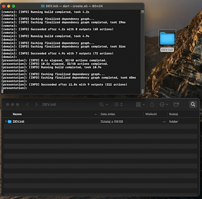

<p align="center">
     <br /><br />
    <span>This is the tool for project creation.<br />
</p>

<p align="center">
    <a href="https://deviniti.com/"></a>
    <a href="./LICENCE"></a>
</p>


# About

Are you tired of creating new Flutter projects directly from scratch? Do you think that it costs you a lot of time and effort to setup the things right? Would you like to have a tool that will do that for you in just a minute?

We faced the same problems and we found a solution. You are in a good place!

We want to introduce you a tool called DEV.init! It provides a quick way to generate new Flutter projects with everything you need! By using it, you will save a lot of time, especially at the beginning of your project.

# Overview

- [ Getting started ](#getting-started)
- [ Next steps ](#next-steps)
- [ What's inside? ](#whats-inside)
    - [ Packages ](#whats-inside-packages)
    - [ Architecture ](#whats-inside-architecture)
    - [ Testing ](#whats-inside-testing)
    - [ Templates & Mason ](#whats-inside-templates-mason)

<a name="getting-started"></a>
## Getting started

- Open terminal and clone this project:
```bash
> git clone https://github.com/deviniti-apps/DEV.init.git
```
<p>
    <br />
</p>

- Go to created folder:
```bash
> cd DEV.init 
```

<p>
    <br />
</p>

- To run project creator type:
```bash
> ./create.sh
```

- The script will ask you about the app name. Provide any single or snake_cased word: 
```bash
> dev_init
```

<p>
    <br />
</p>


- The script will ask you about the package name. Provide e.g. com.deviniti.app:
```bash
> com.deviniti.devinit
```

<p>
<br />
</p>

- Now the project is baking... it's going to take about a minute :)

<p>
    <br />
</p>

<a name="next-steps"></a>
# Next steps
Go to created project, open README file and:
- Install required tools
- Follow required steps to run the project

You may also want to change:
- [Flutter version](https://docs.flutter.dev/development/tools/pubspec)  or [FVM Flutter version](https://fvm.app/docs/guides/basic_commands)
- [Android version](https://docs.flutter.dev/deployment/android)
- [iOS version](https://docs.flutter.dev/deployment/ios)

<a name="whats-inside"></a>
# What's inside?

<a name="whats-inside-packages"></a>
## Packages

These are the packages we are using in the created project:
- [Bloc](https://pub.dev/packages/bloc)
- [Dio](https://pub.dev/packages/dio)
- [Retrofit](https://pub.dev/packages/retrofit)
- [freezed](https://pub.dev/packages/freezed)
- [get_it](https://pub.dev/packages/get_it) 
- [go_router](https://pub.dev/packages/go_router)
- [Melos](https://pub.dev/packages/melos)
- [Mason](https://pub.dev/packages/mason)

...and more! 
Check all the packages here: 
- [presentation](./core/modules/presentation/pubspec.yaml)
- [domain](./core/modules/domain/pubspec.yaml)
- [remote](./core/modules/remote/pubspec.yaml)

<a name="whats-inside-architecture"></a>
## Architecture

The architecture of the created project follows the principles of [Clean Architecture](https://blog.cleancoder.com/uncle-bob/2012/08/13/the-clean-architecture.html). 

We have `remote` and `domain` module. Remote module has domain module. Domain module exposes interfaces
of `remote_data_sources` where `remote` needs to conform to them. It's like a contract of communication between domain
and remote.

All application code is in `presentation` module.

<a name="whats-inside-testing"></a>
## Testing

There is a melos script called `test_coverage`. It uses a tool called `lcov`. You need to install it on your mac. You can do that by running:

```
brew install lcov
```
once you are set with lcov, you can run the Melos script.

```
melos run test_coverage
```

it will generate the test coverage for your package/packages and put the results in the `coverage` folder.

<a name="whats-inside-vsc-extensions"></a>
### Visual Studio Code extensions

The results of the Melos script are possible to connect with Visual Studio Code. You need to do the following:

1. Install the `Flutter Coverage` extension
2. Install the `Coverage Gutters` extension
3. In VS Code change the `settings.json` (CMD + P -> settings.json) file and add:

``` bash
"flutter-coverage.coverageFileNames": [
    "lcov_cleaned.info",
],
"flutter-coverage.coverageFilePaths": [
    "modules/[your-module]/coverage"
    # For example
    # "modules/domain/coverage",
    # "modules/remote/coverage",
    # "modules/presentation/coverage",
],
```


4. Press the `Watch` button - which is at the bottom of the VS Code bar. 

5. See the coverage report separated by files and lines from the `Testing` tab in VS Code.

<a name="whats-inside-templates-mason"></a>
## Templates & Mason

In the created project you can find `mason` directory where you can see the `flutter_screen` and `flutter_remote_usecase` templates.
You can add your own templates or modify existing one. Templates are used to speed up the work.
Thanks to them, you can create default files structure with default implementation.

For example use Mason for generating new screens with associated routes and Bloc. Run:
- `mason make flutter_screen`
in the top project directory and follow the interactive prompts
